# Task Dependencies - Spire Ascent

## Dependency Graph

```mermaid
graph TD
    %% Phase 1 - Foundation & Feel
    BE01[BE-01: Split GameContext] --> BE02[BE-02: Normalize State]
    BE02 --> BE03[BE-03: Meta-progression]
    BE02 --> BE04[BE-04: Ascension System]

    SL01[SL-01: 20 Events] --> SL03[SL-03: Boss Encounters]
    SL02[SL-02: World Building]

    QA02[QA-02: Balance Simulator]
    QA01[QA-01: Component Tests] --> QA03[QA-03: E2E Tests]

    UX01[UX-01: Combat Feedback] --> UX03[UX-03: Deck Viewer]
    UX02[UX-02: Card Info] --> UX04[UX-04: Tutorial]

    GD01[GD-01: Enemy Art Pipeline] --> GD02[GD-02: Card Frames]
    GD01 --> GD03[GD-03: Relic Art]
    GD02 --> GD05[GD-05: VFX & Particles]

    AR01[AR-01: Audio System] --> AR02[AR-02: Save System]
    AR02 --> AR03[AR-03: Settings]
    AR03 --> AR04[AR-04: Mobile]

    JR01[JR-01: Potions] --> JR03[JR-03: Act 2 Enemies]
    JR02[JR-02: Upgrades] --> JR04[JR-04: New Cards]

    PM01[PM-01: Sprint Docs]

    %% Cross-track soft dependencies (dashed = can stub/work around)
    GD01 -.->|assets optional| UX01
    AR01 -.->|audio hooks optional| UX01
    BE01 -.->|new structure optional| JR01
    JR01 -.->|potion effects future| SL01

    %% Phase gates
    BE01 --> BE05[BE-05: Performance]
    QA03 --> QA04[QA-04: Pre-release QA]
    GD03 --> GD04[GD-04: Map Visual]

    %% Styling
    classDef phase1 fill:#e1f5fe,stroke:#0288d1
    classDef phase2 fill:#fff3e0,stroke:#f57c00
    classDef phase3 fill:#e8f5e9,stroke:#388e3c
    classDef critical fill:#ffcdd2,stroke:#d32f2f

    class BE01,SL01,SL02,QA01,QA02,UX01,UX02,GD01,GD02,AR01,JR01,JR02,PM01 phase1
    class BE03,BE04,GD03,GD04,SL03,JR03,JR04,AR02,AR03,QA03 phase2
    class UX03,UX04,GD05,BE05,AR04,QA04 phase3
    class BE01 critical
```



## Key Dependency Corrections (from Brainstorm)

| Original Assumption | Correction | Raised By |
|---------------------|-----------|-----------|
| QA-01 depends on BE-01 | **NO.** QA-01 is independent - tests current interface as regression suite | BE, QA |
| UX-01 depends on GD-01 and AR-01 | **Soft dependency only.** UX stubs art/audio with placeholders | UX |
| JR-01 depends on BE-01 | **Soft dependency.** JR builds data layer now, BE migrates later | BE, JR |
| SL-01 references potions | **Defer.** Events use only currently working effects; potion events added after JR-01 | SL |

## Conflict Zones

Files that multiple tasks touch - must be sequential:

| File | Who Wants It | Agreed Resolution Order |
|------|-------------|------------------------|
| `GameContext.jsx` | BE (rewrite), JR (potions), UX (hooks) | BE-01 first, then JR, then UX |
| `CombatScreen.jsx` | UX (animations), JR (potion UI) | UX-01 first, JR after |
| `src/data/cards.js` | SL (flavor), JR (new cards) | SL-02 first, JR-04 after |
| `App.css` | UX (animations), GD (art styles) | Both append, namespace classes |

## Critical Path

```
BE-01 → BE-02 → JR-01 integration → UX-01 integration → QA validation
```

BE-01 (Context Split) is the single critical-path item for architecture. However, for **investor demo priority**, the critical path is:

```
AR-01 (audio) + UX-01 (feedback) + GD-01 (art) → Visible/audible polish
```

> **Decision:** FEEL over architecture for demo. Architecture enables long-term velocity
> but doesn't impress investors. Both tracks run in parallel.

## Parallel Safety

Morning block tasks touch completely independent files:
- BE-01: `src/context/` (restructure)
- SL-01: `src/data/events.js` (new file)
- QA-02: `src/test/balance/` (new directory)
- QA-01: `src/test/components/` (new directory)
- PM-01: `*.md` files, `package.json` scripts
- GD-01: `public/images/`, `src/components/Enemy.jsx`, `src/utils/assetLoader.js`
- AR-01: `src/systems/audioSystem.js`, `src/components/Settings.jsx`

## Size Warnings

| Task | Listed Size | Actual Risk | Reason |
|------|-------------|-------------|--------|
| AR-04 | M | Potentially L | CombatScreen interaction model rewrite for touch, not just CSS |
| BE-01 | L | L (confirmed) | 2,352 lines, cross-referencing reducers, 289 tests to preserve |
| GD-01 | L | L + manual | Art generation is non-deterministic; pipeline is automatable, curation is not |
| AR-01 | L | L + manual | System is automatable; sourcing 25 CC0 audio files is manual curation |
