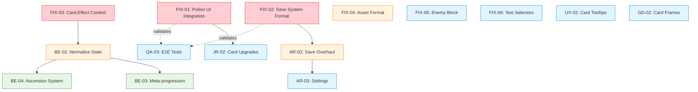
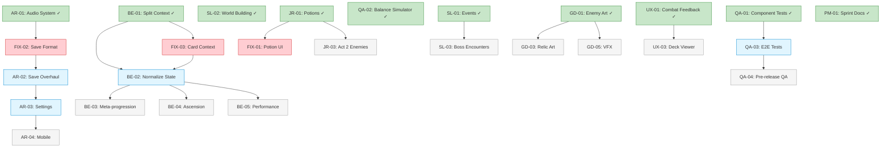

# Task Dependencies - Spire Ascent

**Updated:** 2026-01-24 (Sprint 2 planning)

## Sprint 2 Dependency Graph



## Sprint 2 Execution Order

```
Day 1 (Parallel - zero conflicts):
├── FIX-01: PotionSlots.jsx, GameContext.jsx, useGame.jsx
├── FIX-02: saveSystem.js, metaReducer.js
└── FIX-03: cardEffects.js, combatReducer.js

Day 1-2 (After P0 fixes merged):
├── FIX-04: assetLoader.js
├── BE-02: context/, data/ (state normalization)
└── AR-02: saveSystem.js, metaReducer.js (AFTER FIX-02)

Day 2-3 (After P1 merged):
├── FIX-05: enemies.js, effectProcessor.js
├── FIX-06: Enemy.test.jsx, Enemy.jsx
├── UX-02: Card.jsx, CombatScreen.jsx
├── JR-02: RestSite.jsx, cards.js
├── GD-02: Card.jsx, App.css
├── AR-03: Settings.jsx (AFTER AR-02)
└── QA-03: tests/e2e/ (AFTER P0 fixes)
```

## Conflict Zones (Sprint 2)

| File | Tasks | Resolution Order |
|------|-------|-----------------|
| `saveSystem.js` | FIX-02, AR-02 | FIX-02 first (quick fix), then AR-02 (overhaul) |
| `metaReducer.js` | FIX-02, AR-02 | Same as above |
| `GameContext.jsx` | FIX-01, BE-02 | FIX-01 first (small), then BE-02 (refactor) |
| `combatReducer.js` | FIX-03, BE-02 | FIX-03 first (add ctx.hand), then BE-02 |
| `Card.jsx` | UX-02, GD-02 | Either order - UX adds tooltips, GD adds frames |

## Key Dependency Corrections (from Sprint 1)

| Assumption | Reality | Impact |
|-----------|---------|--------|
| QA-01 depends on BE-01 | QA-01 is independent | QA can run anytime |
| UX-01 depends on GD-01, AR-01 | Soft dependency only (stubs work) | UX can start immediately |
| JR-01 depends on BE-01 | Data layer is independent | Only UI integration needs context |
| FIX-02 and AR-02 are the same | FIX-02 is the quick fix, AR-02 is the proper overhaul | Sequential, not parallel |

## Cross-Track Dependencies (Soft/Optional)

These are "nice to have in order" but NOT blockers:
- GD-02 card frames would be nice before UX-02 tooltips (styling consistency)
- QA-03 E2E tests benefit from all P0 fixes being merged first
- AR-03 settings benefits from AR-02 save system being stable

## Full Project Dependency Graph



## Critical Path (Sprint 2)

```
FIX-01 + FIX-02 + FIX-03 (parallel) → BE-02 → AR-02 → AR-03
                                                       ↘ QA-03
```

The P0 fixes are the gate. Everything else flows after they merge.
