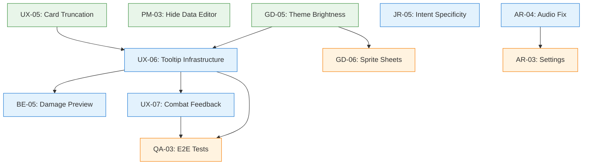
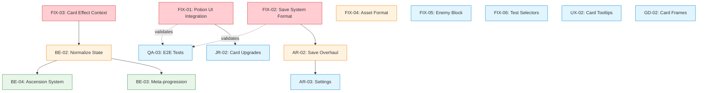

# Task Dependencies - Spire Ascent

**Updated:** 2026-01-25 (Sprint 3 planning)

---

## Sprint 3 Dependency Graph



## Sprint 3 Execution Order

```
Day 1 (Parallel - zero conflicts):
├── GD-05: App.css, theme.css (CSS variables)
├── PM-03: App.jsx (env check)
└── UX-05: App.css, Card.jsx (CSS text overflow)

Day 2 (After Phase A merged):
├── UX-06: NEW Tooltip.jsx, NEW useTooltip.js (no conflicts)
├── JR-05: enemies.js (data file only)
└── AR-04: audioSystem.js (AR-owned)

Day 3 (After UX-06 merged):
├── BE-05: combatSystem.js, card display (damage calculation)
└── UX-07: AnimationOverlay.jsx, useAnimations.js

Day 4+ (After Phase B merged):
├── GD-06: scripts/, assetLoader.js, card components
├── AR-03: Settings.jsx (after AR-04)
└── QA-03: tests/e2e/ (new directory)
```

## Conflict Zones (Sprint 3)

| File | Tasks | Resolution Order |
|------|-------|-----------------|
| `App.css` | GD-05, UX-05 | Can run parallel (different selectors) or GD-05 first |
| `Card.jsx` | UX-05, BE-05 | UX-05 first (styling), then BE-05 (damage display) |
| `AnimationOverlay.jsx` | UX-07 only | No conflict |
| `audioSystem.js` | AR-04, AR-03 | AR-04 first (fix), then AR-03 (settings) |
| `enemies.js` | JR-05 only | No conflict |

## Cross-Track Dependencies (Sprint 3)

| Dependency | Type | Impact |
|------------|------|--------|
| UX-06 → BE-05 | Hard | BE-05 uses tooltip pattern for damage preview |
| UX-06 → UX-07 | Hard | UX-07 may leverage same portal/overlay system |
| AR-04 → AR-03 | Hard | Settings needs working audio first |
| Phase B → QA-03 | Soft | E2E tests more meaningful after UI work |

---

## Sprint 2 Dependency Graph (COMPLETE)



## Sprint 2 Execution Order

```
Day 1 (Parallel - zero conflicts):
├── FIX-01: PotionSlots.jsx, GameContext.jsx, useGame.jsx
├── FIX-02: saveSystem.js, metaReducer.js
└── FIX-03: cardEffects.js, combatReducer.js

Day 1-2 (After P0 fixes merged):
├── FIX-04: assetLoader.js
├── BE-02: context/, data/ (state normalization)
└── AR-02: saveSystem.js, metaReducer.js (AFTER FIX-02)

Day 2-3 (After P1 merged):
├── FIX-05: enemies.js, effectProcessor.js
├── FIX-06: Enemy.test.jsx, Enemy.jsx
├── UX-02: Card.jsx, CombatScreen.jsx
├── JR-02: RestSite.jsx, cards.js
├── GD-02: Card.jsx, App.css
├── AR-03: Settings.jsx (AFTER AR-02)
└── QA-03: tests/e2e/ (AFTER P0 fixes)
```

## Conflict Zones (Sprint 2)

| File | Tasks | Resolution Order |
|------|-------|-----------------|
| `saveSystem.js` | FIX-02, AR-02 | FIX-02 first (quick fix), then AR-02 (overhaul) |
| `metaReducer.js` | FIX-02, AR-02 | Same as above |
| `GameContext.jsx` | FIX-01, BE-02 | FIX-01 first (small), then BE-02 (refactor) |
| `combatReducer.js` | FIX-03, BE-02 | FIX-03 first (add ctx.hand), then BE-02 |
| `Card.jsx` | UX-02, GD-02 | Either order - UX adds tooltips, GD adds frames |

## Key Dependency Corrections (from Sprint 1)

| Assumption | Reality | Impact |
|-----------|---------|--------|
| QA-01 depends on BE-01 | QA-01 is independent | QA can run anytime |
| UX-01 depends on GD-01, AR-01 | Soft dependency only (stubs work) | UX can start immediately |
| JR-01 depends on BE-01 | Data layer is independent | Only UI integration needs context |
| FIX-02 and AR-02 are the same | FIX-02 is the quick fix, AR-02 is the proper overhaul | Sequential, not parallel |

## Cross-Track Dependencies (Soft/Optional)

These are "nice to have in order" but NOT blockers:
- GD-02 card frames would be nice before UX-02 tooltips (styling consistency)
- QA-03 E2E tests benefit from all P0 fixes being merged first
- AR-03 settings benefits from AR-02 save system being stable

## Full Project Dependency Graph

```mermaid
graph TD
    %% Sprint 1 (Done)
    BE01[BE-01: Split Context ✓] --> BE02
    SL01[SL-01: Events ✓]
    SL02[SL-02: World Building ✓]
    QA01[QA-01: Component Tests ✓]
    QA02[QA-02: Balance Simulator ✓]
    UX01[UX-01: Combat Feedback ✓]
    GD01[GD-01: Enemy Art ✓]
    AR01[AR-01: Audio System ✓]
    JR01[JR-01: Potions ✓]
    PM01[PM-01: Sprint Docs ✓]

    %% Sprint 2 (Complete)
    JR01 --> FIX01[FIX-01 ✓]
    AR01 --> FIX02[FIX-02 ✓]
    BE01 --> FIX03[FIX-03 ✓]
    FIX03 --> BE02[BE-02 ✓]
    FIX02 --> AR02[AR-02 ✓]
    UX02[UX-02 ✓]
    GD02[GD-02 ✓]
    JR02[JR-02 ✓]

    %% Sprint 3 (Active)
    GD05[GD-05: Theme]
    PM03[PM-03: Hide Editor]
    UX05[UX-05: Truncation]
    GD05 --> UX06[UX-06: Tooltips]
    UX06 --> BE05[BE-05: Damage Preview]
    UX06 --> UX07[UX-07: Combat Feedback]
    JR05[JR-05: Intent Specificity]
    AR04[AR-04: Audio Fix]
    AR04 --> AR03[AR-03: Settings]
    UX07 --> QA03[QA-03: E2E Tests]
    GD05 --> GD06[GD-06: Sprites]

    %% Phase 2 (Future)
    BE02 --> BE03[BE-03: Meta-progression]
    BE02 --> BE04[BE-04: Ascension]
    SL01 --> SL03[SL-03: Boss Encounters]
    GD01 --> GD03[GD-03: Relic Art]
    JR01 --> JR03[JR-03: Act 2 Enemies]

    %% Styling
    classDef done fill:#c8e6c9,stroke:#388e3c
    classDef sprint3a fill:#e8f5e9,stroke:#2e7d32
    classDef sprint3b fill:#e3f2fd,stroke:#1976d2
    classDef sprint3c fill:#fff3e0,stroke:#f57c00
    classDef future fill:#f5f5f5,stroke:#9e9e9e

    class BE01,SL01,SL02,QA01,QA02,UX01,GD01,AR01,JR01,PM01 done
    class FIX01,FIX02,FIX03,BE02,AR02,UX02,GD02,JR02 done
    class GD05,PM03,UX05 sprint3a
    class UX06,JR05,AR04,BE05,UX07 sprint3b
    class GD06,AR03,QA03 sprint3c
    class BE03,BE04,SL03,GD03,JR03 future
```



## Critical Path (Sprint 3)

```
Phase A (parallel): GD-05 + PM-03 + UX-05
                          ↓
Phase B: UX-06 (tooltips) → BE-05 + UX-07 (parallel)
         JR-05, AR-04 (independent)
                          ↓
Phase C: GD-06, AR-03, QA-03
```

Phase A is the gate. UX-06 (tooltip infrastructure) is the critical path for Phase B.
